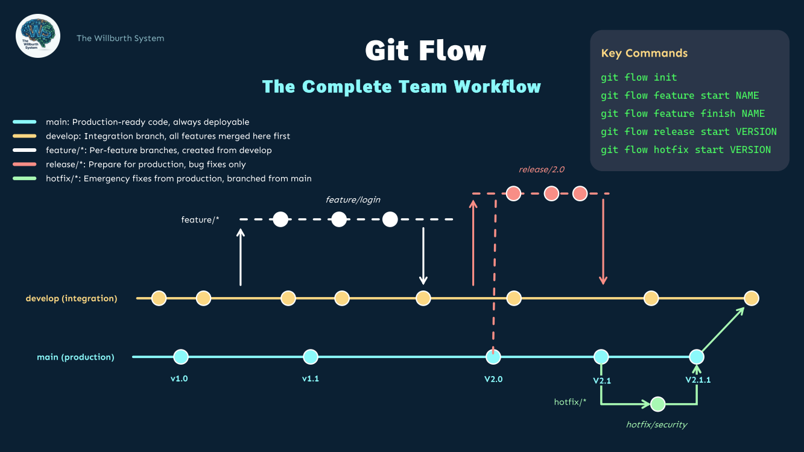

<h1 align="center">
  🛠️ Git & GitHub Starter Toolkit
</h1>

<p align="center">
  
</p>

<p align="center">
  <b>Stop wasting hours setting up your Git & GitHub projects.</b><br/>
  <i>Clone this toolkit to get instant folder structures, configurations, and professional templates.</i>
</p>

---

## 🎁 What's included here (Free)

Clone this repo and you're ready to go:

- 📁 **Ready-to-use directory layouts** for Python, React & Node
- 📝 **Professional GitHub templates** (Pull Requests, Bug Reports, Feature Requests)
- 🛑 **Pre-made configuration files** (.gitignore, Docker, CI workflow)
- 🎨 **Git Flow Visual Poster** (PNG + PDF) — your quick-reference cheat sheet

<br/>

<p align="center">
  
</p>

---

## 💀 Are you making these fatal Git mistakes?

Most developers lose hours every week because they keep repeating the same Git errors. Sound familiar?

- ❌ **Mistake #1** : *"I merged without checking, and now the entire project is broken."* — Without a proper Git Flow, your main branch is a ticking time bomb.
- ❌ **Mistake #2** : *"I can't undo this commit. The code is gone forever."* — Because you never set up a recovery strategy, and `git reflog` is a mystery.
- ❌ **Mistake #3** : *"My `.gitignore` doesn't work, and now sensitive files are pushed to the repo."* — Because you never configured it properly from the start.
- ❌ **Mistake #4** : *"My team overwrites each other's code constantly."* — Because there are no PR templates, no review process, no conventions.

**These mistakes cost developers 5-10 hours per week. That's 250+ hours per year. Wasted.**

---

## 🎒 Want more? Check out my resources

I build visual guides, cheat sheets, and tools to help developers work smarter. 

Discover my free & premium resources on my Gumroad store — including eBooks, templates, and pro bundles for Git, Docker, API & more.

<br/>

<p align="center">
  <a href="https://jameswillburth.gumroad.com">
    
  </a>
</p>

---

## 🚀 Quick Start

```bash
# Clone this toolkit
git clone https://github.com/TheWillburthSystem/git-github-toolkit.git

# Copy the files into your project
cp -r git-github-toolkit/.github/ your-project/
cp -r git-github-toolkit/templates/ your-project/
cp git-github-toolkit/.gitignore your-project/
```

---

<p align="center">
  <i>Built with ❤️ by <b>James Willburth</b> (<b>The Willburth System</b>)</i><br/>
  <a href="https://github.com/TheWillburthSystem">GitHub</a> · <a href="https://jameswillburth.gumroad.com">Gumroad</a>
</p>
